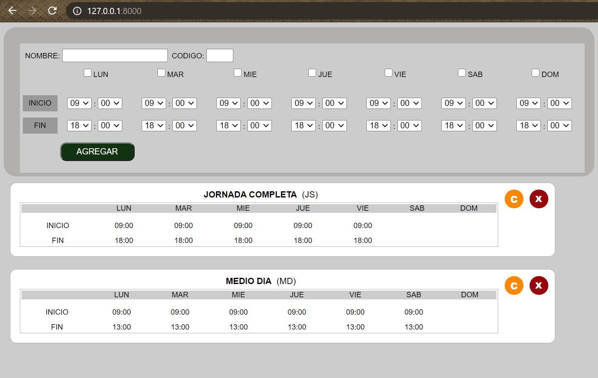

TEST JORNADAS (HCMFRONT)

INSTALACIÓN

1. Clonar repositorio en carpeta de equipo local 
2. En la carpeta de destino ingresar al directorio JORNADAS.
3. En linea de comandos (terminal) escribir: "python manage.py runserver" para subir servicios y aplicacion.
4. En Browser ingresar a URL: http://127.0.0.1:8000/

ENDPOINTS LOCALES

CREAR TURNO NUEVO:  http://127.0.0.1:8000/API/1.0/create_turno  
CONSULTA TURNO:     http://127.0.0.1:8000/API/1.0/consulta_turno/(id)  
ELIMINA TURNO:      http://127.0.0.1:8000/API/1.0/elimina_turno/(id)  
MODIFICAR TURNO:    http://127.0.0.1:8000/API/1.0/modifica_turno/(id)  

